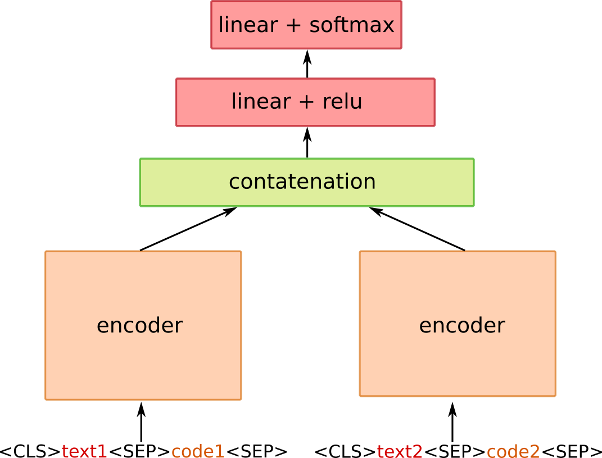

# MQDD - Multimodal Question Duplicity Detection

This repository publishes trained models and other supporting materials for the paper 
[MQDD – Pre-training of Multimodal Question Duplicity Detection for Software Engineering Domain](https://arxiv.org/abs/2203.14093). For more information, see the paper.

The Stack Overflow Datasets (SOD) and Stack Overflow Duplicity Dataset (SODD) presented in the paper can be obtained from our [Stack Overflow Dataset repository](https://github.com/kiv-air/StackOverflowDataset).

## Available Models

### 1) Pre-trained MQDD model

First model that we make publicly available is the MQDD model, which is based on a Longformer architecture and is pre-trained on 218.5M training examples. The model was trained using MLM training objective acompanied with our novel Same Post (SP) and Question Answer (QA) learning objectives targetting specifically the duplicate detection task. 

The model can be obtained from our [HuggingFace repository](https://huggingface.co/UWB-AIR/MQDD-pretrained) and can be loaded using the following source code snippet:

```Python
from transformers import AutoTokenizer, AutoModel

tokenizer = AutoTokenizer.from_pretrained("UWB-AIR/MQDD-pretrained")
model = AutoModel.from_pretrained("UWB-AIR/MQDD-pretrained")
```

Besides, our model is also available at our [GoogleDrive folder](https://drive.google.com/drive/folders/1rSlb_wgb1kGP0ciDSWmpKSR9GDT0-273?usp=sharing).

### 2) Fine-tuned MQDD model (duplicates)

In addition to the pre-trained MQDD, we also release its fine-tuned version on duplicate detection task. The model's architectture follows the architecture of a two-tower model as depicted in the figure below:



## How to Use the MQDD?

## Downstream Tasks Fine-tuning Results


## Licence
This work is licensed under a Creative Commons Attribution-NonCommercial-ShareAlike 4.0 International License. http://creativecommons.org/licenses/by-nc-sa/4.0/

## How should I cite the MQDD? 
For now, please cite [the Arxiv paper](https://arxiv.org/abs/2203.14093):
```
@misc{https://doi.org/10.48550/arxiv.2203.14093,
  doi = {10.48550/ARXIV.2203.14093},
  url = {https://arxiv.org/abs/2203.14093},
  author = {Pašek, Jan and Sido, Jakub and Konopík, Miloslav and Pražák, Ondřej},
  title = {MQDD -- Pre-training of Multimodal Question Duplicity Detection for Software Engineering Domain},
  publisher = {arXiv},
  year = {2022},
  copyright = {Creative Commons Attribution Non Commercial Share Alike 4.0 International}
}
```
